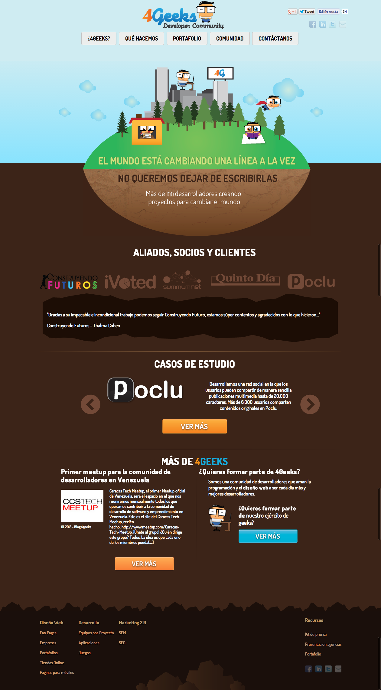

Soy un ingeniero de software con un diploma en Administración de Empresas de una de las instituciones educativas más destacadas de LATAM enfocada en negocios. He estado programando desde hace 25 años y he desarrollado importantes proyectos de infraestructura como el sistema de gestión penitenciaria en [Guanajuato, México](https://guanajuato.gob.mx/), y el sistema de administración de seguridad social en Venezuela. También he participado activamente en la comunidad de desarrolladores fundando uno de los eventos tecnológicos más grandes de LATAM: [The Tech Meetup](https://www.youtube.com/watch?v=z1vKJwkCUtM), con más de 20,000 asistentes, en colaboración con Startup Chile, varias cámaras de comercio en diferentes países, y más.

Antes de graduarme de la universidad, cofundé la Comunidad de Desarrolladores 4Geeks para abordar la brecha entre los puestos de trabajo abiertos para roles de ciencias de la computación y la producción real de talento en los mercados laborales de LATAM.

Sitio web de la Comunidad de Desarrolladores 4Geeks en 2009

En 2014, 4Geeks se convirtió 100% en una escuela de tecnología, y hoy es reconocida como una de las mejores escuelas de programación del mundo según Forbes.com, Fortune.com, Newsweek.com, y muchas otras publicaciones reconocidas globalmente. Los cursos que he construido están siendo tomados por decenas de miles de personas alrededor del mundo. 4Geeks ha formado formalmente a más de 5,000 desarrolladores de software sin conocimientos previos de programación, y su plataforma de aprendizaje autónomo está siendo utilizada por miles de otras personas para aprender nuevas habilidades cada día.

4Geeks se ha convertido rápidamente en un vehículo para diferentes países y gobiernos en LATAM y EE.UU. para abordar sus escaseces de talento en la fuerza laboral y desarrollar soluciones ágiles y rápidas de formación y desarrollo de talento.

En los primeros días de cofundar 4Geeks, descubrí un problema con las herramientas: las plataformas de enseñanza ampliamente adoptadas eran demasiado genéricas, y las más especializadas eran muy caras y propietarias. Por eso decidí crear LearnPack (https://learnpack.co/). LearnPack es una plataforma educativa impulsada por IA utilizada por 4Geeks y muchas otras instituciones educativas prominentes. Tiene cientos de miles de usuarios alrededor del mundo, ayudándoles a desarrollar habilidades de una manera atractiva e interactiva mientras se adhiere a los más altos estándares pedagógicos.

<iframe width="560" height="315" src="https://www.youtube.com/embed/Ul-TBJXqcjc?si=8DEZ1PsljZRiPS_F" title="YouTube video player" frameborder="0" allow="accelerometer; autoplay; clipboard-write; encrypted-media; gyroscope; picture-in-picture; web-share" referrerpolicy="strict-origin-when-cross-origin" allowfullscreen></iframe>

También he creado Rigobot, un mentor de programación con IA completamente integrado en LearnPack y 4Geeks.com, nuestra plataforma principal para enseñar programación y habilidades relacionadas con la tecnología. Rigobot responde preguntas de los estudiantes en un chat, revisa su código y recomienda mejoras mientras duermen, lee activamente su código y pantalla mientras practican, y está listo para responder preguntas y sugerir correcciones.

En 2024, los ingresos de 4Geeks alcanzaron los $8 millones anuales mientras continúa creciendo como una importante plataforma educativa.

Hoy, el 90% del código que escribo es generado por IA, y he desarrollado docenas de productos utilizando este enfoque. 