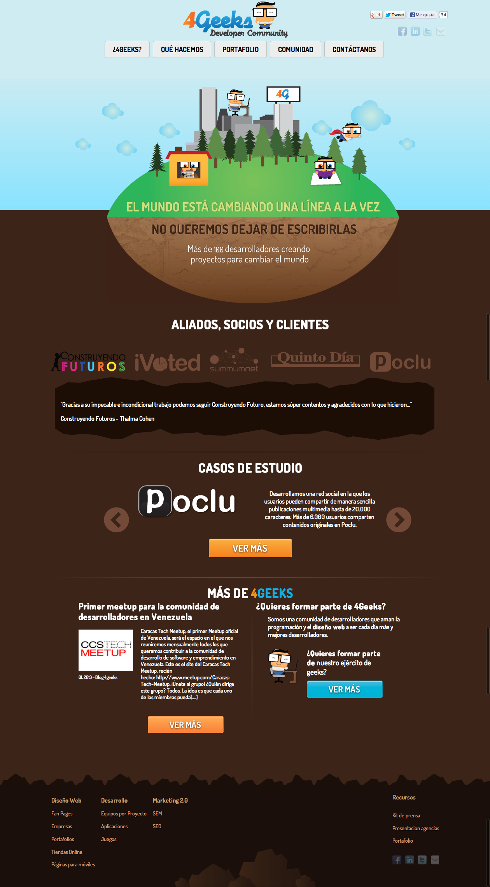
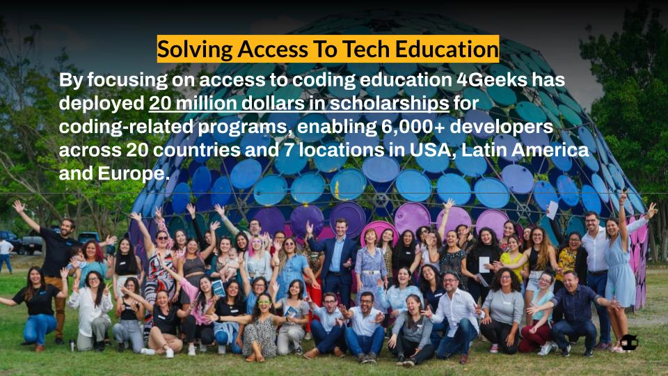

> Before we start, I think its important to know that you are in good hands

I'm a software engineer with a BA diploma from one of the most prominent educational institutions in LATAM focused on business. I've been coding since 25 years ago and have developed major infrastructure projects like the prison management system in [Guanajuato, Mexico](https://guanajuato.gob.mx/), and the social security administration system in Venezuela. I have also actively participated in the developer community by founding one of the biggest tech events in LATAM: [The Tech Meetup](https://www.youtube.com/watch?v=z1vKJwkCUtM), with more than 20,000 attendees, in collaboration with Startup Chile, various chambers of commerce in different countries, and more.

Before graduating from university, I co-founded the 4Geeks Developers Community to address the gap between open job positions for computer science roles and the actual talent output in the workforce markets around LATAM.

4Geeks Developers Community Website back in 2009

In 2014, 4Geeks turned 100% into a tech school, and today it is recognized as one of the top coding schools in the world according to Forbes.com, Fortune.com, Newsweek.com, and many other globally recognized publications. The courses I've built are being taken by tens of thousands of people around the globe. 4Geeks has formally trained more than 5,000 software developers with no prior coding knowledge, and its self-paced platform is being used by thousands of other people to learn new skills every day.

4Geeks has rapidly become a vehicle for different countries and governments in LATAM and the USA to address their workforce talent shortages and develop agile, fast training and talent development solutions.

In the early days of co-founding 4Geeks, I discovered a tooling issue: the widely adopted teaching platforms were too generic, and the more specialized ones were very expensive and proprietary. That's why I decided to create LearnPack (https://learnpack.co/). LearnPack is an AI-powered educational platform used by 4Geeks and many other prominent educational institutions. It has hundreds of thousands of users around the globe, helping them develop skills in an engaging, interactive way while adhering to the highest pedagogical standards.

<iframe width="560" height="315" src="https://www.youtube.com/embed/Ul-TBJXqcjc?si=8DEZ1PsljZRiPS_F" title="YouTube video player" frameborder="0" allow="accelerometer; autoplay; clipboard-write; encrypted-media; gyroscope; picture-in-picture; web-share" referrerpolicy="strict-origin-when-cross-origin" allowfullscreen></iframe>

I have also created Rigobot, an AI coding mentor fully integrated into LearnPack and 4Geeks.com, our main platform for teaching coding and tech-related skills. Rigobot answers students' questions in a chat, reviews their code and recommends improvements while they sleep, actively reads their code and screen as they practice, and is ready to answer questions and suggest corrections.

In 2024, 4Geeks' revenues reached $8 million per year as it continues to grow into an important educational platform.

Today, 90% of the code I write is generated by AI, and I have developed dozens of products using this approach.