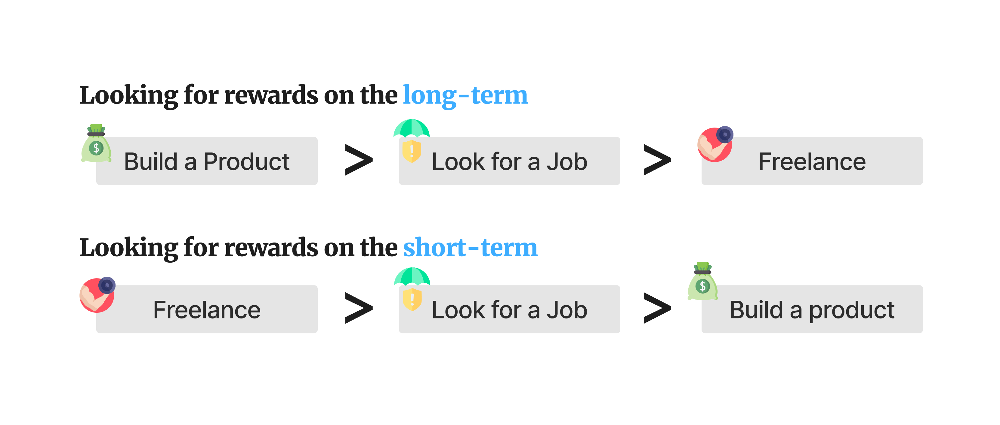
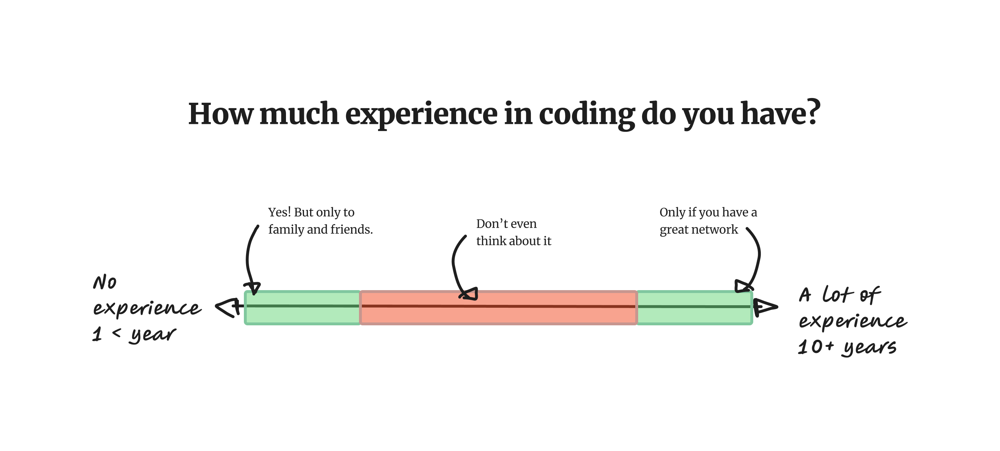
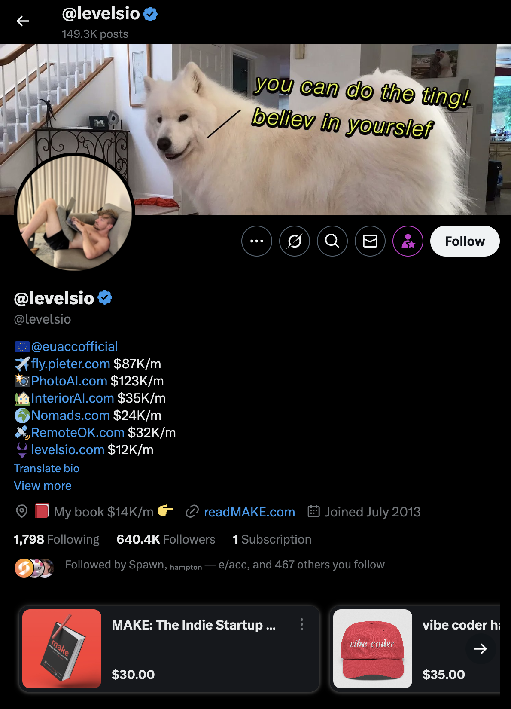

## How Much Can You Earn with AI-First Software Development?

The Fact is, the AI industry’s set to hit $1 trillion by 2030, and companies are paying top dollar for developers who can code with AI expertise. If you’re good at it, you can earn life-changing money, and I’m here to show you how achievable that is. Let’s get right into it—here’s what you could make.

## Earning Potential for AI-First Developers

Until today, the fastest and better path to make money as a dev was looking for a job, and it still may be, but with in breakout of AI new variables are making me re-evaluate my answers. I'm not yet sure about the fastes approach but I certain that being a product builder will make you more money. The question is: How fast do you need to start making money?

## The fastest way is still finding a job in a company

If you work for a company, your earnings depend on experience. 

With a 2 years of coding under your belt, you’re looking at $100,000 to $150,000 annually in the U.S. That’s a solid start. 

But if you’re skilled—say, building advanced AI models—senior roles at firms like Google or xAI pay $200,000 to $300,000. 

In tech hubs like San Francisco, add bonuses and stock options, and you could hit $400,000 or more as an AI architect. Every step you take builds toward that.

On the other hand, finding your first job may take a whole year, or shorter if you do a bootcamp. But with lot's of practice needed, building a real portfolio, resume, etc.

## Freelancing

In my experience, freelancing has little to do with AI, it does not matter if you use or don't use AI. Freelancing its a painful task that should only be done if you are a part of one of these two groups: A) You are starting in your AI Coding career. B) You are an experienced developer with a network of contacts.

### Freelancing without experience

I think is a great idea if you have no experience whatsoever, but for different reasons than you think, you will be making your first bucks but at the same time earnin very valuable experience. If you can start working on a freelancing project `RIGT NOW` then I think its a great idea, just make sure your "client" is family and friends because there will be lots of bumbs in the road, you will be making a lot of mistakes and you will pay for them, with hours and hard work, and you client will get mad unless you already have a great relationship and communication.

### Freelancing without lot's experience

I don't recommend freelancing to mid-senior or senior developers, only if you are VERY senior and have a network of contacts, the freelancer live is less about coding than you think, and more about client management, billing, etc.

If you’re among the best, freelancing pays $100 to $250 per hour. At 30 hours a week, that’s $150,000 to $500,000 a year. A single project—like an AI tool for a startup—might bring in $50,000 to $200,000. You control the gig, and the income reflects your effort. It’s within reach with practice.

> Note: This is another reminder that being a great freelancer requires a lot of experience because software projects are hard and it's easy to deliver late of with bugs and you end up paying the price.

## Entrepreneurship: The Big Payoff

A successful AI product, like a small SaaS tool, could earn $10,000 monthly—$120,000 a year. Scale it up, and you might see $1 million or more annually. If you build a startup and it gets acquired, you could pocket millions. It’s a bolder move, but the rewards match the ambition.

It's becoming a trend in 2025 because it has never been easier to build products, there is not at lot of documentation but there is a lot of people building in public, here is a great just to name a few:

| Name                | What They’re Building                          | Monthly Revenue (Approx.)         | How They Build in Public                                      | Where to Follow             |
|---------------------|-----------------------------------------------|-----------------------------------|--------------------------------------------------------------|-----------------------------|
| Pieter Levels       | Nomad List                                    | $38K/mo (as of 2022)             | Shares revenue, code, and launches on X in real-time         | X (@levelsio), levels.io   |
|                     | Remote OK                                     | $35K/mo (as of 2022)             |                                                              |                             |
|                     | PhotoAI                                       | $100K/mo (as of Sep 2024)        |                                                              |                             |
| Daniel Nguyen       | TelemetryDeck (privacy-focused analytics)     | ~$5K/mo (estimate, 2023)         | Posts feature updates, revenue, and challenges on X          | X (@d__nguyen), telemetrydeck.com |
| Courtland Allen     | Indie Hackers                                 | Sold to Stripe (revenue N/A)     | Shares SaaS journey via Indie Hackers and X posts            | X (@csallen), indiehackers.com |
|                     | Job Board Fire                                | ~$1K/mo (estimate, pre-sale)     |                                                              |                             |
| Arvid Kahl          | FeedbackPanda (sold)                          | $55K/mo (at sale in 2019)        | Blogs and tweets about SaaS strategies and lessons           | X (@arvidkahl), arvidkahl.com |
|                     | New projects                                  | Not disclosed                    |                                                              |                             |
| Jon Yongfook        | Bannerbear (image/video generation API)       | $50K/mo (as of 2022)             | Shares revenue, tech insights, and growth on X and blog      | X (@yongfook), bannerbear.com |
| KP                  | ShipFast (SaaS boilerplate)                  | ~$10K/mo (estimate, 2023)        | Updates progress, sales, and dev insights on X               | X (@thisiskp_), shipfa.st  |

## Skills needed to do AI-Driven Development

| Skill | Description |
|-------|-------------|
| Clear goal-setting | Define exactly what you want your project to achieve before building it |
| Basic problem-solving | Break down challenges into simple, solvable steps to guide the process |
| Familiarity with AI building tools | Know how your AI tool works to get the best results from it |
| Prompt refinement | Tweak your instructions to the AI until it delivers what you need |
| Patience and experimentation | Test, adjust, and iterate without rushing to perfect the outcome |
| Technical discernment | Spot flaws or inefficiencies in the AI's output to ensure quality |

### Aditional skills if you want to build products

| User-centric design | Build with the user's needs and experience in mind for better adoption |
| Marketing basics | Promote your project effectively to get it noticed by the right people |
| Feedback handling | Listen to users and adapt your work based on their input |
| Be live on social media | Share your work strategically on platforms to reach users without constant posting |

## How Much Is Possible?

If you’re really good—think “solving tough problems with AI” good—you could earn $500,000 to $1 million a year within 5–10 years. Combine a job with side projects, and you’re there. The top 1%—researchers or founders—sometimes make tens of millions through breakthroughs or sales. You don’t need to be them yet; steady progress gets you far.