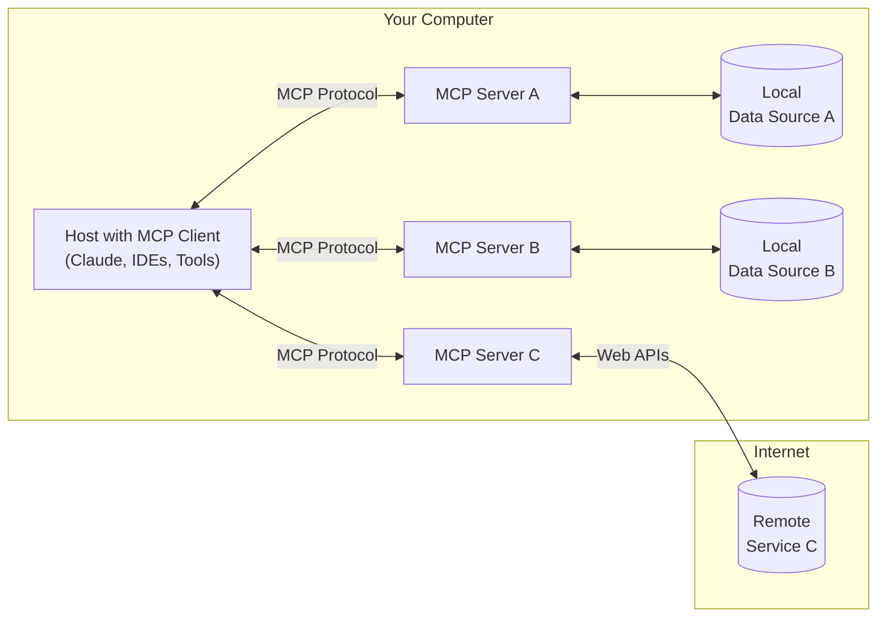

Think of the Model Context Protocol (MCP) as a secure bridge that lets AI tools (like Cursor, ChaGPT or LearnPack) safely access your information. In simple terms, MCP is a standard way for AI to connect with your files, data, and online services while keeping you in control. 

> 🔥 **It solves a big problem**: AI needs context to be helpful, but you need privacy. 

With MCP, you decide exactly what information your AI can see and use - nothing happens without your permission. It's like giving AI a limited access pass to only the information you choose to share.

> 🔗 Here is the [official documentation for MCP](https://modelcontextprotocol.io/)

## Why Vibe Coders Should Care About MCP

As a Vibe Coder, MCP is particularly important as it one of the tools that can more rapidly affect your productivity and privacy:

- **Connect to Everything:** AI can safely access more than just your files
  * Documentation
  * APIs
  * Online resources
  * All while respecting your privacy
  
- **Better AI Coding Help:** AI sees your whole project, not just one file
  * Smarter code suggestions
  * Better code improvements
  * AI actually understands what you're building

- **Keep Your Code Safe:** You control what AI can see
  * Protect private code and business secrets
  * Share only what you choose
  * Your intellectual property stays secure

- **Same Experience Everywhere:** Works the same across different AI tools
  * Cursor, GitHub Copilot, or other AI coding tools
  * Your settings follow you everywhere

- **Stay Ahead of the Curve:** Be ready for the AI future
  * Prepare for more AI in coding
  * Use new AI features safely as they appear

* **MCP Hosts**: Programs like Claude Desktop, IDEs, or AI tools that want to access data through MCP
* **MCP Clients**: Protocol clients that maintain 1:1 connections with servers
* **MCP Servers**: Lightweight programs that each expose specific capabilities through the standardized Model Context Protocol
* **Local Data Sources**: Your computer's files, databases, and services that MCP servers can securely access
* **Remote Services**: External systems available over the internet (e.g., through APIs) that MCP servers can connect to
